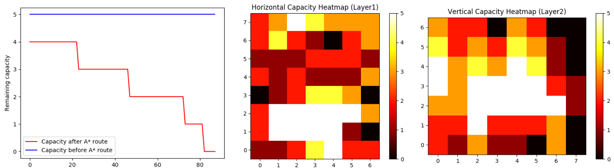
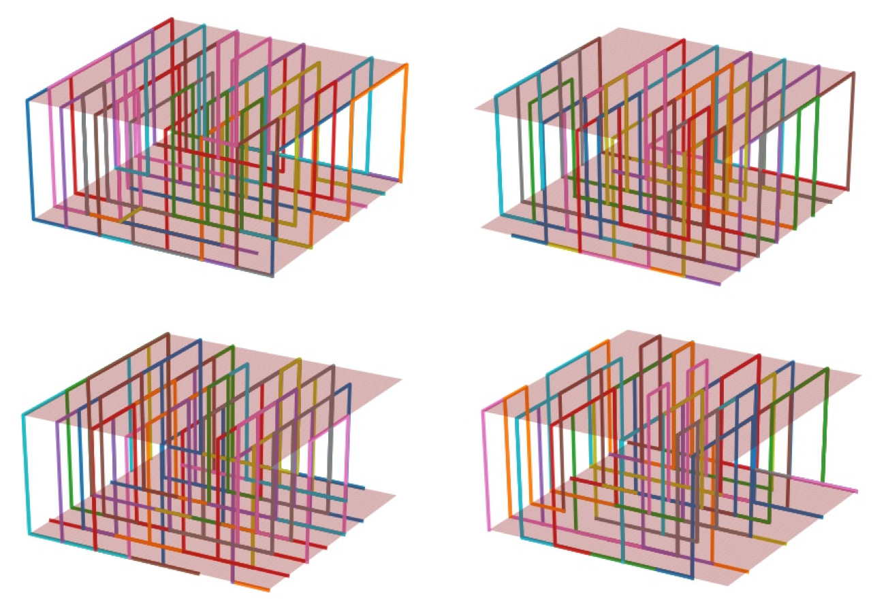
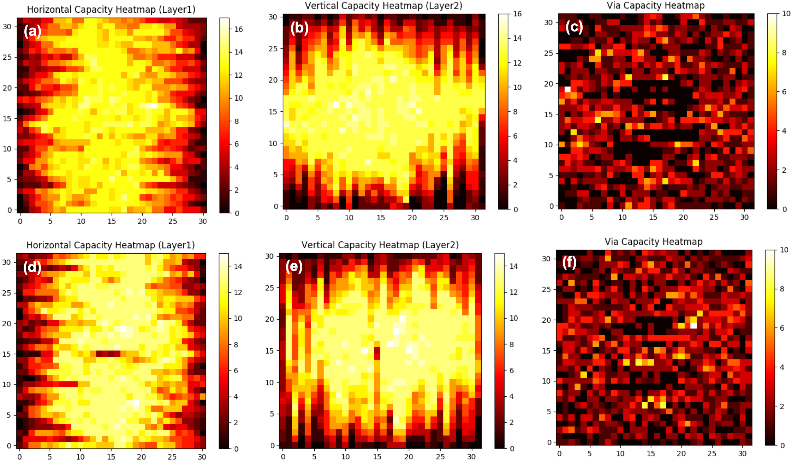

# Global Routing Problem Generator V1.0
This repository functions as an automatic problem generator for global routing problems. Benchmarks (or problem sets)  are generated and then solved with A\*Search so that a baseline solution is provided and a rough estimate of congestion can be obtained.
Congestion are described by heatmaps representing traffic on edges of different directions (horizontal, vertical,via) and edge utilization count plot.

<br />There are two types of generated problems: the first type problems only have speficed global capacity (stored in folder "**benchmark**"); the second type problems have both spefified global capacity and reduced capacity (stored in folder "**benchmark_reduced**"). The reduced capacity blocked edges in descending orders of edge utilization based on A\* solution .i.e. blocking edges with highest edge utilization in A\* solution.

<br /> The generated problems sets will faciliate development of machine-learaning-based global routing algorithms that relies on large amount of training datasets to make it generalizable.

<br /> Some details of the code are as follows:
#### 1. Python Version: Python3.6
#### 2. Packages: 
os, operator, matplotlib, numpy, argparse, collections, spicy, sys, mpl_toolkits. To install them:
```
pip install <package_name>.
```
You might need to install some extra packages in your environment to run the generator.

#### 3. Parameters to be specified includes: 
- number of generated problems (benchNumber)
- gridSize, number of nets in each problem (netNum) 
- global capacity (capacity), maximum number of pins for each net (maxPinNum)
- reducedCapNum (number of edges with reduced capacity). 
In existing version of code, reduced capacity edges are set with zero capacity, i.e. fully blocked.
####  4. To run the generator, specify problem parameters as follows:
```
python Main.py --benchNumber 10 --gridSize 8 --netNum 50 --capacity 5 --maxPinNum 2 --reducedCapNum 3
```
#### 5. Output:
- benchmark: generated problems with only global capacity specification
- benchmark_reduced: generated problems with global capacity specification and reduced capacity specification
- capacityPlot_A*: capacity plot of edge utilizations for problems in "benchmark" folder in different directions (horizontal, vertical) for individual problems (with number) and averaged over all problems (without number); edge utilization count plot
<p align="center">

</p>

- capacityPlot_A*_reduced:  capacity plot of edge utilizations for problems in "benchmark_reduced" folder in different directions (horizontal, vertical) for individual problems (with number) and averaged over all problems (without number); edge utilization count plot
- solutionsA*: solution files for problems in "benchmark" folder given by A*Search router together with plot for solutions
<p align="center">

</p>

- solutionsA*_reduced: solution files for problems in "benchmark_reduced" folder given by A*Search router together with plot for solutions
#### 6. Warning: 
when executed again, previously generated problems, solutions and plots will be removed.

#### Appendix: capacity plot of a 32*32 size problem
<p align="center">

</p>
