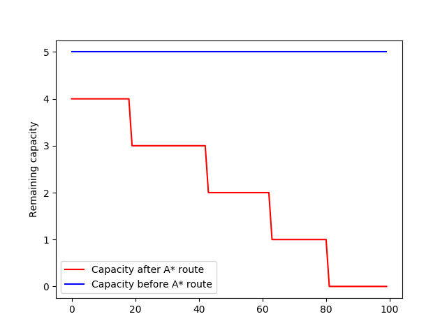

# Global Routing Problem Generator V1.0
Benchmark Generator for Global Routing
This repository functions as an automatic problem generator for global routing problems. Benchmarks are solved with A*Search so that a baseline solution is provided and a rough estimate of congestion can be obtained.
Heatmaps representing traffic on edges of different directions (horizontal, vertical,via) are given.   

#### 1. Python Version: Python3.6
#### 2. Packages: 
os, operator, matplotlib, numpy, argparse, collections, spicy, sys, mpl_toolkits. To install them:
```
pip install <package_name>.
```
You might need to install some extra packages in your environment to run the generator.

#### 3. Parameters to be specified includes: 
- number of generated problems (benchNumber)
- gridSize, number of nets in each problem (netNum) 
- global capacity (capacity), maximum number of pins for each net (maxPinNum)
- reducedCapNum (number of edges with reduced capacity). 
In existing version of code, reduced capacity edges are set with zero capacity, i.e. fully blocked.
####  4. To run the generator, specify problem parameters as follows:
```
python Main.py --benchNumber 10 --gridSize 8 --netNum 50 --capacity 5 --maxPinNum 2 --reducedCapNum 3
```
#### 5. Output:
- benchmark: generated problems with only global capacity specification
- benchmark_reduced: generated problems with global capacity specification and reduced capacity specification
- capacityPlot_A*: capacity plot of edge utilizations for problems in "benchmark" folder in different directions (horizontal, vertical) for individual problems (with number) and averaged over all problems (without number); edge utilization count plot
- capacityPlot_A*_reduced:  capacity plot of edge utilizations for problems in "benchmark_reduced" folder in different directions (horizontal, vertical) for individual problems (with number) and averaged over all problems (without number); edge utilization count plot
- solutionsA*: solution files for problems in "benchmark" folder given by A*Search router together with plot for solutions
- solutionsA*_reduced: solution files for problems in "benchmark_reduced" folder given by A*Search router together with plot for solutions
#### 6. Warning: 
when executed again, previously generated problems, solutions and plots will be removed.


#### Images showing edge traffic in 300-by-300 benchmarks.
![image showing horizontal capacity]


